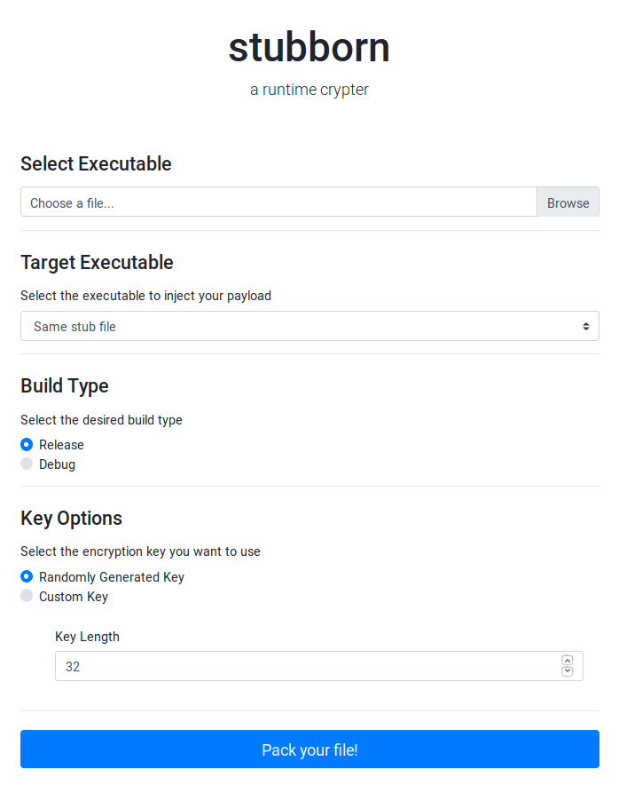

# stubborn

stubborn is a runtime crypter built as a web service. It allows uploading an executable file,
which will be encrypted and embedded into a stub. When the stub is executed, it will decrypt
the original file in memory, inject it to a selected process and start its execution.

This is an ongoing project on its early stages. Its aim is to build a crypter that allows a full 
customization of the stub, that is, choosing among different process injection techniques,
encryption algorithms, anti-analysis techniques, etc.


## Usage

To start the service, you just need to start the Docker container:
```bash
docker-compose up -d
```

This will start a Flask app. The UI can then be accessed at http://127.0.0.1:5000. You'll see the following form:

<kbd></kbd>

Upload your file, select the desired options, and you're ready to go!

## Features

- Supports Windows .exe files, both 32 and 64 bits
- The stub is compiled at the same moment the executable is uploaded
- Currently, the process injection is done only via *Process Hollowing*
- You can select among different target executables to inject the process,
including the same stub
- The stub includes some code emulation and sandbox detection techniques, as well as some junk imports
- The imports that are typical for *Process Hollowing* are resolved by the stub itself, parsing the exports
table of the corresponding DLLs
- If the build type "Debug" is selected, when you execute the stub you will get information about
all the steps that are being made at each moment

## References

All the techniques used are known and have been implemented multiple times. The main references that I have used are the
following:

- *One packer to rule them all*, by Arne Swinnen and Alaeddine Mesbahi. 
See the [Black Hat paper](https://www.blackhat.com/docs/us-14/materials/us-14-Mesbahi-One-Packer-To-Rule-Them-All-WP.pdf),
the [Black Hat talk](https://www.youtube.com/watch?v=gtLMXxZErWE) or the [BruCON talk](https://www.youtube.com/watch?v=nPmbpBYmLpM).
- *Process Hollowing*, by John Leitch. See the [paper](http://www.autosectools.com/Process-Hollowing.pdf) or [this GitHub repo](https://github.com/m0n0ph1/Process-Hollowing).
- *RunPE*, the implementation of *Process Hollowing* by [@hasherezade](https://github.com/hasherezade/). See the [GitHub repo](https://github.com/hasherezade/libpeconv/tree/master/run_pe/).
- Microsoft's documentation on the [PE format](https://docs.microsoft.com/en-us/windows/desktop/debug/pe-format) as well as Matt Pietrek's
[Peering Inside the PE: A Tour of the Win32 Portable Executable File Format](https://docs.microsoft.com/en-us/previous-versions/ms809762(v=msdn.10)).

## TODO

Many things, among which (in no particular order):
- Improve UI
- Add more process injection techniques
- Add more encryption algorithms 
- Add more antivirus evasion techniques and make them customizable
- Support Linux binaries
- Validate executable file format on upload
- Add tests
- ...

## Acknowledgements

Thanks to [@newlog](https://github.com/newlog/) who gave me the idea of building a crypter in the first place, and build it as a web service!